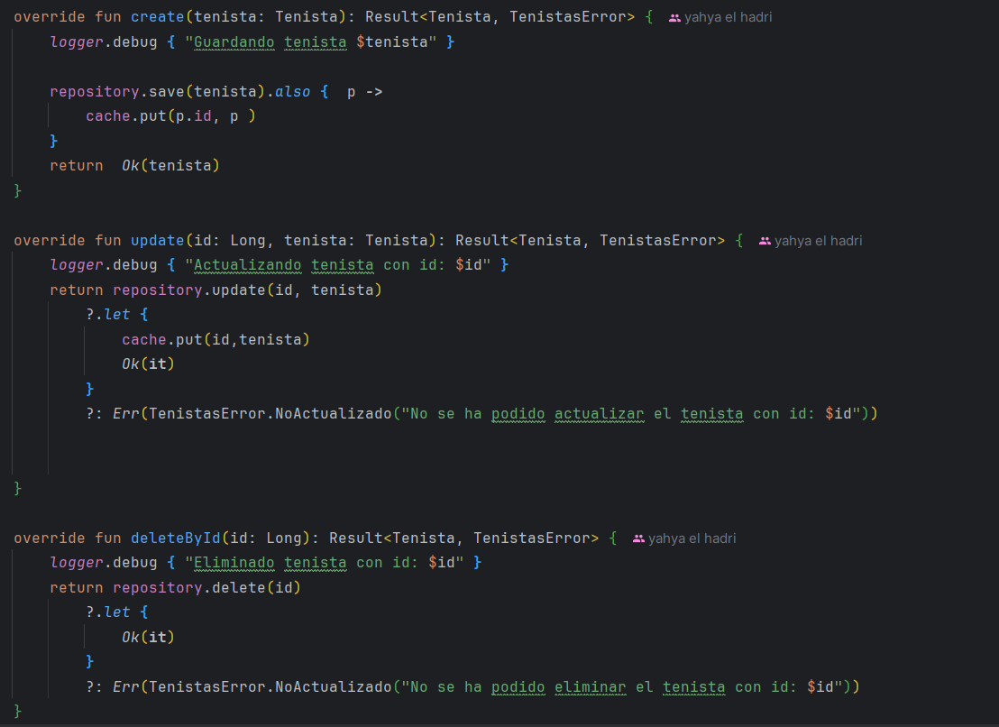
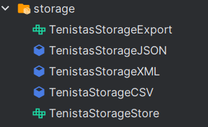
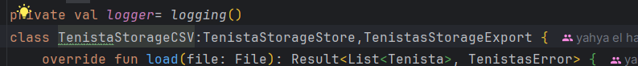

# Torne De Tenis 
### Yahya el hadri el bakkali 

## Descripción del proyecto.
Este programa está diseñado para realizar un procesamiento avanzado de datos a partir de un archivo CSV, que es leído, validado y luego almacenado en una base de datos SQLite. A través del uso de SqlDelightManager.

Después de que los datos han sido procesados y almacenados en la base de datos, el programa permite la conversión de esa misma información a diferentes formatos de archivo. El usuario tiene la posibilidad de exportar los datos almacenados en:
- CSV
- JSON
- XML

Además, el programa incluye un sistema de registro de eventos (loggers) que permite mantener un seguimiento de las operaciones realizadas.

## Arquitectura usada
Utilizo la arquitectura monolitica ya que toda la lógica de la aplicación está contenida en un solo proyecto o paquete.

## Principios SOLID

1. S - Single Responsibility Principle (SRP) - Principio de responsabilidad única

2. O - Open/Closed Principle (OCP) - Principio de abierto/cerrado

3. L - Liskov Substitution Principle (LSP) - Principio de sustitución de Liskov

4. I - Interface Segregation Principle (ISP) - Principio de segregación de interfaces

5. D - Dependency Inversion Principle (DIP) - Principio de inversión de dependencias

## Librerias Usadas
 - Logger: Para registrar los eventos que suceden y en que momento
    implementation("org.lighthousegames:logging:$logging_version")
    implementation("ch.qos.logback:logback-classic:$logback_version")
- SqlDelight: Libreria para el manejo de la base de datos
    implementation("org.xerial:sqlite-jdbc:3.45.2.0")
    implementation("app.cash.sqldelight:sqlite-driver:2.0.2")
- Serialization JSON: para poder convertir los objetos en JSON para poder manejarlo.
    implementation("org.jetbrains.kotlinx:kotlinx-serialization-json:1.6.3")
- Result ROP: Para poder devolver error o un valor y asi quitarnos de utilizar nulos.
    implementation("com.michael-bull.kotlin-result:kotlin-result:2.0.0")
- XML: Para poder escribir en XML 
    implementation("io.github.pdvrieze.xmlutil:core-jvm:0.86.3")
    implementation("io.github.pdvrieze.xmlutil:serialization-jvm:0.86.3")
- Mordant: Nos permite dar color a la ejeccuion por consola
    implementation("com.github.ajalt.mordant:mordant:2.0.0-beta9")

