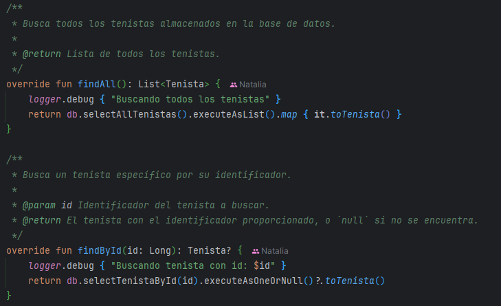
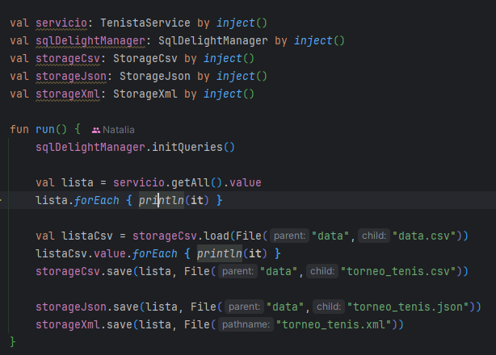

## Descripción del proyecto
TenistasApp es una aplicación para gestionar información sobre tenistas. Utiliza Koin para la inyección 
de dependencias y SQLDelight para la persistencia de datos en una base de datos SQLite. La aplicación 
soporta la carga y el guardado de datos en formatos CSV, JSON y XML.

## Arquitectura usada
Arquitectura en capas.

## Principios SOLID
* S – Principio de Responsabilidad Única (SRP)

* O – Principio de Abierto/Cerrado (OCP)
* L – Principio de Sustitución de Liskov (LSP)
* I – Principio de Segregación de la Interfaz (ISP)

* D – Principio de Inversión de Dependencias (DIP)

## Librerías usadas
* `kotlinx.serialization` para serializar los datos en formato JSON.
* `com.michael-bull.kotlin-result:kotlin-result:2.0.0` para el manejo de errores.
* `org.lighthousegames:logging:1.3.0` y `ch.qos.logback:logback-classic:1.4.14` para el uso de loggers.
* `io.github.pdvrieze.xmlutil:core-jvm:0.86.3` y `io.github.pdvrieze.xmlutil:serialization-jvm:0.86.3` para serializar los datos en formato XML.
* `io.insert-koin:koin-bom:3.5.6` para el uso de inyección de dependencias.
