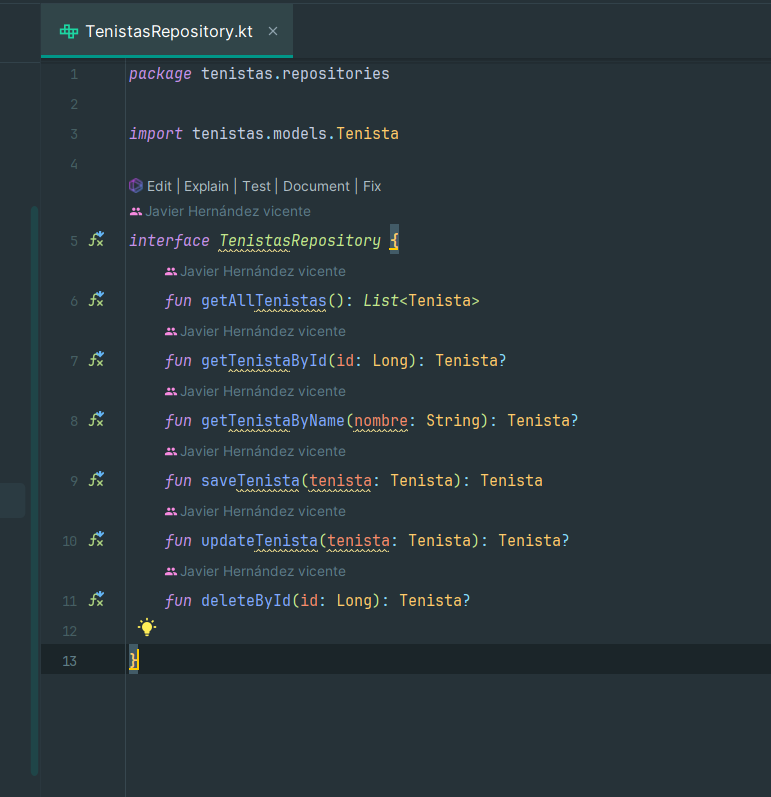

# Práctica de bienvenida 2ºDAW

### Descricpción del proyecto:
Debemos leer un archivo csv con una lista de tenistas de los cuales almacenaremos los siguientes datos:
* id (autonumérico)
* nombre: nombre del tenista completo
* pais: nombre del país
* altura: altura del tenista en cm
* peso: peso del tenista en kg
* puntos: puntos totales del tenista
* mano: mano del tenista, DIESTRO o ZURDO
* fecha_nacimiento: fecha de nacimiento del tenista, en * * * formato AAAA-MM-DD (ISO 8601)
* created_at: fecha de creación del tenista, en formato * * * AAAA-MM-DDTHH:MM:SS.SSSSSSS (ISO 8601)
* updated_at: fecha de actualización del tenista, en formato * AAAA-MM-DDTHH:MM:SS.SSSSSSS (ISO 8601)

Una vez leido el fichero deberemos almacenar los datos en una base da datos. También deberemos realizar las siguientes consultas:
* tenistas ordenados con ranking, es decir, por puntos de * * mayor a menor
* media de altura de los tenistas
* media de peso de los tenistas
* tenista más alto
* tenistas de España
* tenistas agrupados por país
* número de tenistas agrupados por país y ordenados por * * * puntos descendente
* numero de tenistas agrupados por mano dominante y * * * * * puntuación media de ellos
* puntuación total de los tenistas agrupados por país
* país con más puntuación total
* tenista con mejor ranking de España.

Por último deberemos crear un documento xml, json o csv que saque los tenistas de la base de datos ordenados por el ranking de forma descendeinte.

El programa se ejecutará usando el archvio .jar por el cual se le introducirá el argumento de entrada (fichero csv de lectura) y se especificará la ruta del fichero de salida y su extensión. En caso de que no se especifique la ruta de salida se creará un archivo json en el directorio actual por defecto.

### Arquitectura usada:
Se ha utilizado un patrón de diseño Facade en el cual un servicio se comunica con diferenetes modulos para simplificar las llamadas al subsistema. 
Por otro lado se ha utilizado la arquitectura por dominios para la organización del código.

### Principios Solid:
* S – Single Responsibility Principle (SRP)
* O – Open/Closed Principle (OCP)
* L – Liskov Substitution Principle (LSP)
* I – Interface Segregation Principle (ISP)
* D – Dependency Inversion Principle (DIP)

Uno de los principios usados en este proyecto es el principio de responsibilidad única. Este principio dice que cada módulo debe realizar una operación en específico teniendo la responsabilidad sobre solo una parte específica del programa. En este proyecto cada módulo se ocupa de una cosa en específico. Por ejemplo el repository nos permite realizar operaciones CRUD con la base de datos. El validador valida la entrada de argumentos y el servicio se comunica con el repositorio.

Otro de los principio solid utilizados es el de segregación de interfaces. Este principio indica que debemos priorizar tener interfaces con pocos métodos pero más especificos que tener interfaces con muchos métodos a los cuales no se les dará uso.

### Librerías utilizadas:
LighthouseGames logger: Utilizado para mostrar los loggers por consola.
https://github.com/LighthouseGames/KmLogging

SqlDelight: Utilizado para el manejo de la base de datos con SqlLite de forma que automatizamos la conexión con la base de datos y la generación de queries.

app.cash.sqldelight:sqlite-driver:2.0.2

Kotlin result: Utilizado para la implementacion del ROP(Railway Oriented Programming) permitiendo un sistema de errores tipados al dominio
https://github.com/michaelbull/kotlin-result

Kotlinx Serialization: Usado para realizar la serialización de una clase a un archivo JSON
https://github.com/Kotlin/kotlinx.serialization

xmlutil: Utilizado para la serialización de una clase a un archivo XML.
https://github.com/pdvrieze/xmlutil

Mordant: Para dara color a los resultados mostrados por consola.
https://mvnrepository.com/artifact/com.github.ajalt.mordant/mordant